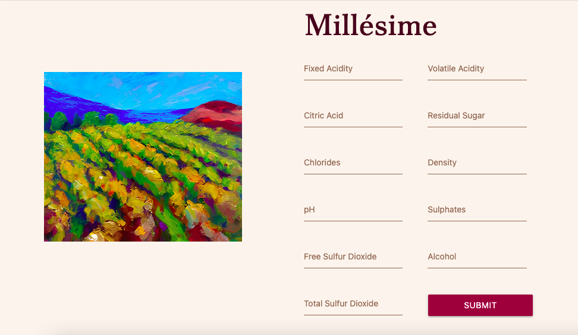

# Millésime

This is an application that uses machine learning to predict the quality of a wine based on its physicochemical parameters. The app was built using Scala (Play Framework) and Python.

## Getting Started

To get started with the app, follow these steps:

1. Clone the repository to your local machine
2. Go to `app/services/python` and install the necessary dependencies by running `pip install -r requirements.txt`
3. Still at the `app/services/python` folder, run `generate_model.py`. It will generate the regressor.pkl
4. Make sure you have Scala Build Tools installed on your machine and run the app by executing the command `sbt run` on the root folder.
5. Visit `http://localhost:9000` in your web browser to use the app

## How to Use

Once you have the app running, you can enter the physicochemical parameters of the wine (such as pH, alcohol density, etc.) into the input fields. The app will use a trained machine learning model to predict the quality of the wine based on these parameters.

## Machine Learning Model

The machine learning model used by this app is a Stacking Regressor model, which combines the predictions of Random Forest, Extra Trees, and Bagging regressors. The final output is obtained through a Gradient Boosting Regressor. The model has been trained on a dataset of physicochemical measurements and corresponding wine quality ratings. It aims to predict the quality of a wine on a scale of 0 to 10, based on 11 physicochemical parameters.

## Dataset

The dataset used to train the machine learning model is the [Wine Quality Dataset](https://archive.ics.uci.edu/ml/datasets/wine+quality) from the UCI Machine Learning Repository. This dataset contains 11 physicochemical measurements for each of 1599 red wines, as well as a quality rating for each wine on a scale of 0 to 10.

## Contributing

If you would like to contribute to the development of this app, please feel free to submit a pull request or open an issue. All contributions are welcome!

## License

This app is licensed under the MIT License. See the `LICENSE` file for more details.